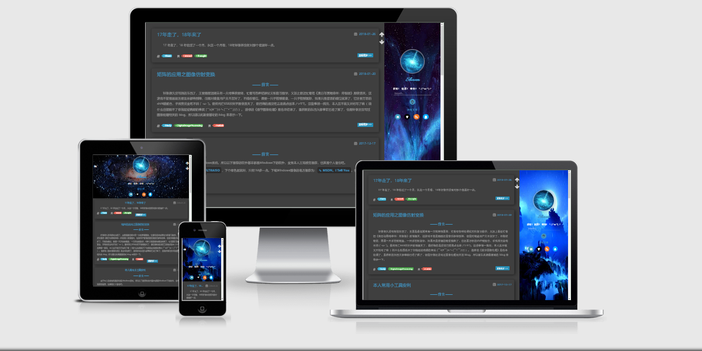

本主题主要基于「[SPFK Hexo 主题](https://github.com/luuman/hexo-theme-spfk)」修改，主要修改如下：

1. 参考「[black-blue主题](https://github.com/maochunguang/black-blue)」修改css配色，将其页面颜色改成以黑色和蓝色为主；
2. 添加本地搜索，主要参考 [让 Hexo 博客支持本地站内搜索](http://moxfive.xyz/2016/05/31/hexo-local-search/) ；
3. 添加Gitalk评论系统；
4. 交换内容栏与菜单栏位置，使菜单栏位于右侧；
5. 添加文章目录折叠功能，完全参考 [为 Hexo 添加可折叠的文章目录](http://moxfive.xyz/2016/06/13/hexo-collapsible-toc/) ；
6. 改善部分代码，添加一些小玩具。

更多细节可查看 [Hexo的SPFK主题修改小记](https://cniter.github.io/posts/b1e9411b.html)（ https://cniter.github.io/tags/hexo/ ）。

*以上相关版权归原作者所有。*

***

推荐安装插件：

- hexo-generator-feed # RSS订阅
- hexo-generator-searchdb # 本地搜索
- hexo-abbrlink # 文章唯一永久链接
- hexo-all-minifier # 快速压缩优化代码

本人 2018-01-26 还在使用该主题。